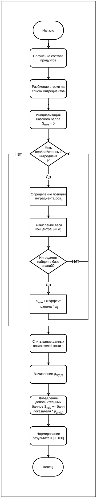

# АИС «Аура»: бизнес-правила

Документ фиксирует ограничения доступа, правила формирования профиля, расчёта совместимости, использования знаний и обработки исключений. Правила взяты из спецификации и ВКР; отдельный раздел показывает детали проверенного кода и расхождения источников.

[Процессы и сценарии](processes.md) · [Модель данных](data-model.md)

## Основания и обозначения

- [Спецификация требований](../requirements.pdf): § 1.3, 2.2, 3–6.
- [Текст ВКР](https://github.com/KristinaShishigina00/Aura/blob/master/docs/thesis.pdf): § 2.1–2.2, 2.4; рисунки 20, А.3, А.8.
- [Исходные материалы портфолио](https://disk.yandex.ru/d/VklDQSwuq2aAjw).
- Код локальной ревизии `f4d01c6`: статическая сверка, без проверки работающей системы.

Идентификаторы `BR-AURA-*` назначены в этом конспекте для навигации. В столбце «Основание» указаны исходные требования или страницы ВКР. Правила спецификации описывают **требуемое поведение**, а не результаты проведённых здесь испытаний. Формулы ВКР и сведения о реализации явно обозначены.

## 1. Границы и доступ

| ID | Условие / область | Правило | Основание |
| --- | --- | --- | --- |
| BR-AURA-01 | Доступ к системе | Гостевой доступ отсутствует; учётная запись связана с ролью | Спецификация, § 2.2 |
| BR-AURA-02 | Регистрация и вход | Вход выполняется по email и паролю; успешная авторизация выдаёт токен доступа | `SR-F-1.1` |
| BR-AURA-03 | Недействительный или просроченный токен | Сервер отклоняет запрос, клиент возвращается к авторизации | `SR-IF-3.2` |
| BR-AURA-04 | Ввод в обязательную форму | Отправка разрешена после корректного заполнения обязательных полей; ошибки формата обозначаются в интерфейсе | `SR-IF-1.2`, `SR-QA-1.2` |
| BR-AURA-05 | Границы продукта | В MVP отсутствуют корзина, оплата, доставка, публикация отзывов и рейтингов, постановка дерматологических диагнозов и интеграция с медицинскими ИС | Спецификация, § 1.3 |

### Матрица ролей по спецификации

| Функция | Пользователь | Дерматолог-косметолог | Контент-менеджер | Администратор |
| --- | --- | --- | --- | --- |
| Вести личный паспорт, получать рекомендации, использовать чат | Предусмотрено для роли | Отдельно не определено | Отдельно не определено | Полный доступ по `UR-07` |
| Создавать обучающие статьи | Не предусмотрено | Да | Нет | Требует согласования с общими полномочиями |
| Читать и менять собственный обучающий контент | Не предусмотрено как автору | Да | Модерация существующего контента | Полный доступ по `UR-07` |
| Модерировать и удалять существующие статьи | Не предусмотрено | Права собственного контента | Да | Полный доступ по `UR-07` |
| Вести продукты и системные справочники | Не предусмотрено | Отдельно не определено | Да | Да |
| Проверять извлечённые знания и правила | Не предусмотрено | Да | Отдельно не определено | Требует согласования с конкретными служебными правами |
| Управлять ролями и конфигурацией | Не предусмотрено | Не предусмотрено | Не предусмотрено | Да |

Основание: `UR-01`–`UR-07`, `SR-F-5.1`–`SR-F-5.3`. Формулировка «Отдельно не определено» не означает разрешение: она показывает отсутствие соответствующего права в описании роли. В источниках есть конфликт между уникальным правом специалиста создавать статьи и полными полномочиями администратора; он приведён в разделе 8.

## 2. Профиль и исходные данные

| ID | Условие | Правило | Основание |
| --- | --- | --- | --- |
| BR-AURA-06 | Заполнение анкеты | Данные сохраняются в гибком формате и используются как основа персонализации | `SR-F-1.2` |
| BR-AURA-07 | Пользователь указывает ограничения | Аллергены и индивидуальные непереносимости входят в цифровой профиль и учитываются при расчёте совместимости | `SR-F-1.3` |
| BR-AURA-08 | Использование внешнего датчика | Показатели вводит пользователь вручную через экранную форму | `SR-F-2.1` |
| BR-AURA-09 | Датчик отсутствует | По схеме А.3 аппаратная ветвь пропускается, профиль формируется по доступным анкетным данным | ВКР, стр. 102 |
| BR-AURA-10 | Добавление процедуры или измерения | Запись истории содержит дату; принадлежность определяется пользователем | `SR-F-5.4`, `SR-DB-1.10`, `SR-DB-1.11` |

Алгоритмические показатели устройства используются как вход системы. Этот документ не вводит новые клинические пороги и не оценивает точность аппаратного измерения.

## 3. Совместимость и безопасность подбора

| ID | Условие | Правило / результат | Основание |
| --- | --- | --- | --- |
| BR-AURA-11 | Расчёт для продукта и профиля | Индекс совместимости выражается в диапазоне `0–100%` | `SR-F-3.1` |
| BR-AURA-12 | В составе обнаружен ингредиент из стоп-листа пользователя | Совместимость обнуляется, продукт получает предупреждающую маркировку | `SR-F-3.2` |
| BR-AURA-13 | Состав недостаточен для расчёта | Индекс не рассчитывается либо равен `0%`; выводится статус «Недостаточно данных»; приложение продолжает работу | `SR-F-3.3`, приоритет «Крайне желательное» |
| BR-AURA-14 | Допустимые кандидаты оценены | Кандидаты ранжируются по итоговой оценке, формируется выборка наиболее релевантных продуктов | ВКР, § 2.4, стр. 50 |
| BR-AURA-15 | Пользователь рассматривает рекомендацию | Результат сопровождается интерпретацией причин подбора | ВКР, стр. 30, 50 |

В модели ВКР продукты с выявленными аллергенами исключаются из множества допустимых кандидатов **до ранжирования**. Высокая семантическая близость не должна отменять это ограничение безопасности.

### 3.1. Проектная математическая модель ВКР

В § 2.4, стр. 43–50, описана комбинация экспертного и семантического индексов:

```text
S_final = 0.8 × S_rule + 0.2 × S_sem
S_sem = 50 × (cosine_similarity + 1)
```

Экспертная оценка использует пять критериев. В ВКР веса записаны как доли; в коде максимумы компонентов заданы баллами на общей шкале 100.

| Критерий | Вес по ВКР | Максимум баллов в `SCORE_MAX` |
| --- | --- | --- |
| Биохимическое соответствие состава | 0,34 | `ingredient_function_fit`: 34 |
| Состояние кожи | 0,24 | `skin_state_fit`: 24 |
| Доказательность эффективности | 0,20 | `evidence_quality`: 20 |
| Безопасность | 0,15 | `safety_fit`: 15 |
| Подтверждение характеристик / метаданные | 0,07 | `metadata_confirmation`: 7 |

Для перевода нормированных частных оценок `f_i ∈ [0,1]` и долевых весов в процентную шкалу применяется представление `S_rule = 100 × Σ(λ_i × f_i)`. В исходном тексте формулы (3) множитель `100` явно не записан, хотя диапазон `S_rule` задан как `[0,100]`. Здесь масштаб указан отдельно, чтобы не смешивать доли и баллы.

### 3.2. Позиционный вес ингредиента

ВКР, формула (8), стр. 48; функция `_ingredient_position_weight` в текущем коде:

| Позиция в составе | Множитель воздействия правила |
| --- | --- |
| 1–5 | 1,0 |
| 6–10 | 0,7 |
| После 10 | 0,4 |

Позиция служит приближением для расчёта в модели проекта. Множитель не является измеренной концентрацией вещества и не заменяет данные о массовой доле.

### 3.3. Нечёткая интерпретация увлажнённости

В ВКР, формула (9), стр. 49, задана степень принадлежности показателя `s` к терму «Сухая кожа»:

```text
μ_dry(s) = 1,             если s ≤ 30
μ_dry(s) = (50 − s) / 20, если 30 < s < 50
μ_dry(s) = 0,             если s ≥ 50
```

Значение `μ_dry` применяется в алгоритмической коррекции оценки. Код `get_fuzzy_hydration` дополнительно определяет термы `normal` и `hydrated` и ограничивает вход значениями `0–100`. Это правило расчёта конкретного проекта, а не самостоятельный медицинский критерий.

<details>
<summary>Исходная блок-схема экспертного расчёта — рисунок А.8, страница 107 ВКР</summary>



</details>

### 3.4. Уточнения текущего кода

В проверенной функции [match_product](../../backend/core/matching/scoring.py) итоговый балл получается суммированием компонентов `score_breakdown`. Аргумент `semantic_score` добавляет пояснение, но не входит в арифметическую формулу этой функции. Поэтому формулу `0.8 / 0.2` нельзя представлять как подтверждённое поведение именно этого расчётного контура.

В [domain.py](../../backend/core/matching/domain.py) и [rule_application.py](../../backend/core/matching/rule_application.py) определены следующие правила реализации:

| Условие | Реакция кода |
| --- | --- |
| Правило не имеет статуса `confirmed` | Не применяется в `apply_matching_rules` |
| Эффект `block` и условие совпало | Решение `exclude`, итог и совместимость `0`, дальнейшая обработка правил прекращается |
| Эффект `warning` | Решение `caution`, предупреждение; отрицательная поправка может уменьшить компонент безопасности |
| Эффект `boost` | Увеличение компонента соответствия функций в пределах его максимума |
| Эффект `penalty` | Уменьшение компонента соответствия функций с нижней границей `0` |
| Итоговый балл меньше `50`, продукт не исключён | Решение `caution` |
| Решение `exclude` | Отображаемая совместимость `0` |
| Решение `caution` | Совместимость ограничена сверху `69`; при исходном проценте ниже `40` применяется нижняя граница `35` |

Следовательно, отображаемый процент для `caution` может отличаться от округлённой суммы компонентов. Значения `50`, `65` и `55` относятся к разным стадиям: `50` — порог решения в матчинге; `65` — константа основного подбора линейки; `55` — константа альтернатив в [selection.py](../../backend/core/recommendations/selection.py). Единый порог для всех экранов в спецификации не установлен.

В том же модуле выбора линейки реализован отбор одного лучшего средства на функциональную ячейку. Порядок ежедневных этапов: очищение → тонер → активный уход → увлажнение → SPF. Эти сведения относятся к реализации формирования линейки, а не к самостоятельным требованиям таблицы 7.

## 4. Чат, контекст и устойчивость

| ID | Условие | Правило | Основание |
| --- | --- | --- | --- |
| BR-AURA-16 | Пользователь ведёт диалог | История сохраняется как сессии и сообщения | `SR-F-4.1` |
| BR-AURA-17 | Запрос передаётся в LLM | К запросу системно добавляются данные профиля | `SR-F-4.2` |
| BR-AURA-18 | Подготовка ответа | Предварительно выполняется поиск релевантных материалов в векторной базе | `SR-F-4.3` |
| BR-AURA-19 | Чат открыт из карточки | Контекст включает сведения о выбранном продукте | ВКР, стр. 40 |
| BR-AURA-20 | Используются пользовательские вложения | В поиске учитываются идентификаторы пользователя и текущей сессии | ВКР, стр. 55 |
| BR-AURA-21 | LLM недоступна или запрос превысил таймаут | Запрос прекращается с уведомлением; сбой не должен блокировать каталог, профиль и расчёт совместимости | `SR-F-4.4`, `SR-DEP-1.2`, `SR-IF-2.2`, `SR-QA-2.2` |
| BR-AURA-22 | Пропало интернет-соединение | Сетевые функции блокируются без аварийного завершения приложения | `SR-QA-2.1` |

По описанию ВКР, стр. 55, ответ должен опираться на предоставленный контекст и указывать первоисточники. Правило относится к проектируемому поведению ассистента; качество фактического ответа требует отдельной проверки.

## 5. Извлечённые факты и правила сопоставления

Необходимо различать **факт об ингредиенте** (`ingredient_evidence`) и **правило сопоставления** (`matching_rules`). У них разные статусы и способы включения в расчёт.

### Факты: состояния по диаграмме и коду

| Статус | Условие / переход | Использование в коде |
| --- | --- | --- |
| `draft` | Уверенность извлечения ниже `0,82` либо требуется доработка | Не включается в выборку для пересборки функционального профиля |
| `auto_high_confidence` | Уверенность не ниже `0,82` | Может использоваться без ручного подтверждения |
| `confirmed` | Подтверждён при проверке | Используется в функциональном профиле |
| `rejected` | Отклонён при проверке | Не включается в выборку функционального профиля |

Порог `0,82` показан на рисунке 20 и задан константой `AUTO_CONFIDENCE_THRESHOLD` в [ingredient_knowledge.py](../../backend/ingredient_knowledge.py). В [пересборке функционального профиля](../../backend/core/ingredient_knowledge_admin.py) выбираются `confirmed` и `auto_high_confidence`: множитель подтверждённого факта — `1,0`, автоматически допущенного — `0,65`, дополнительно учитывается его уверенность.

### Правила: состояния и эффекты

Статусы правила в [helpers.py](../../backend/core/matching/helpers.py): `draft`, `confirmed`, `disabled`. В `apply_matching_rules` применяются только `confirmed`. Возможные эффекты — `block`, `warning`, `boost`, `penalty`; цель и условие должны совпасть с продуктом и профилем.

| ID | Правило | Основание |
| --- | --- | --- |
| BR-AURA-23 | Извлечённое знание сохраняет ссылку на источник, цитату, уверенность и статус | ВКР, стр. 60–61; `ingredient_evidence` |
| BR-AURA-24 | Решение о допуске факта учитывает его статус; автоматически допущенный факт отличается от экспертно подтверждённого | Рисунок 20; `ingredient_knowledge.py`, `ingredient_knowledge_admin.py` |
| BR-AURA-25 | Для применения правила матчинга требуется `confirmed`; черновик и отключённое правило не участвуют | `apply_matching_rules` |
| BR-AURA-26 | Блокирующий эффект имеет приоритет над положительной поправкой оценки | `apply_matching_rules` |

<details>
<summary>Исходная диаграмма состояний — рисунок 20, страница 62 ВКР</summary>


</details>

В исходной диаграмме блок «Подтверждён» содержит подпись «Не участвует в расчётах». Это противоречит выборке `confirmed` в коде и пояснениям ВКР. Подпись в изображении сохранена как часть оригинала; таблица выше описывает проверенную логику кода.

## 6. Сохранение, удаление и предложения обновления

| ID | Условие | Правило | Основание |
| --- | --- | --- | --- |
| BR-AURA-27 | Сохраняются связанные данные | Операция должна быть атомарной; при сбое любой стадии транзакция откатывается | `SR-QA-2.3` |
| BR-AURA-28 | Пользователь удаляет аккаунт | Удаляются профиль, история процедур и диалогов | `SR-DB-2.1` |
| BR-AURA-29 | Применяется предложение изменить паспорт | Изменение поля применяется при принятии предложения пользователем | `passport_updates.py`, код |
| BR-AURA-30 | Предложение уже обработано | Повторное изменение его статуса блокируется | `passport_updates.py`, код |

Для BR-AURA-28 наличие каскадных FK подтверждает поведение реляционных записей. Полное удаление файлов и векторов не подтверждается одним SQL-каскадом и требует отдельной проверки.

## 7. Примеры проверяемых условий

Это примеры критериев проверки документа, а не отчёт о выполненных тестах.

| Правило | Исходное условие | Ожидаемый результат |
| --- | --- | --- |
| BR-AURA-12 | INCI продукта содержит аллерген из профиля | Индекс `0%`, предупреждение; продукт не входит в допустимый подбор |
| BR-AURA-13 | Состав отсутствует или недостаточен | Статус «Недостаточно данных»; отсутствие содержательной оценки не выдаётся за рассчитанную совместимость |
| Позиционный вес | Компонент находится на позициях 5, 6, 10, 11 | Множители соответственно `1,0`, `0,7`, `0,7`, `0,4` |
| Нечёткая функция | `s = 30`, `40`, `50` | `μ_dry = 1`, `0,5`, `0` |
| BR-AURA-24 | Уверенность извлечения `0,81` и `0,82` | Начальные статусы соответственно `draft` и `auto_high_confidence` |
| BR-AURA-25 | Условие правила совпало, статус `draft` | Правило не применяется в `apply_matching_rules` |
| BR-AURA-21 | LLM не отвечает до таймаута | Уведомление в чате; работоспособность остальных функций сохраняется |
| BR-AURA-27 | Сбой записи части связанных данных | Полный откат транзакции |

## 8. Пункты, требующие согласования источников

| Пункт | Различие | Как отражено в этом документе |
| --- | --- | --- |
| Итоговая формула | ВКР задаёт смесь `0,8/0,2`; backend `match_product` суммирует компоненты без семантической поправки | Формула названа проектной; поведение конкретной функции описано отдельно |
| Масштаб экспертной оценки | ВКР использует долевые веса и одновременно диапазон `0–100` | Переход к баллам записан явно; это пояснение масштаба |
| Порог рекомендации | Рисунок А.3 показывает `>50%`; в коде есть порог решения `50` и константы линейки `65/55` | Значения привязаны к стадиям, общий порог не выдуман |
| Модерация фактов | Текст на стр. 61 требует ручной проверки всех фактов; рисунок 20 и код допускают уверенность `≥0,82` автоматически | Указаны обе версии; факты и правила разделены |
| Подтверждённый факт | Подпись в рисунке 20 исключает его из расчётов, код включает | Оригинал не исправлен; логика кода пояснена |
| Права сотрудников | Спецификация выделяет право создания статей специалисту, но даёт полный доступ администратору; в ВКР роль администратора также описана иначе | Ограничения приведены по источникам, окончательная матрица требует согласования |
| Управление правилами | `UR-04` относит проверку правил к специалисту; `MATCHING_RULE_ADMIN_ROLES` в локальном коде включает администратора и менеджера | Наличие права специалиста в работающем интерфейсе не заявлено как подтверждённое |

Неопределённые параметры, например погодные пороги и исчерпывающие критерии полноты состава, не дополнены произвольными значениями. Для публикации портфолио этот документ показывает как формализацию правил, так и прослеживаемость до источников.
