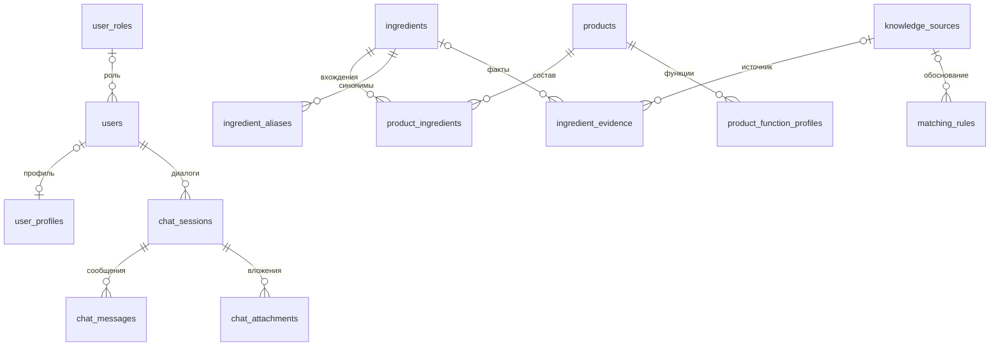

| `chat_messages` | Сообщение в сессии | PK `id`; FK `session_id`; текст, отправитель, время, источники |
| `chat_attachments` | Файл, добавленный пользователем в сессию | PK `id`; FK пользователя и сессии; путь, MIME-тип, извлечённый текст и время индексации |
| `procedures` | Процедуру в общем каталоге | PK `id`; название, описание и характеристики; FK на справочники |
| `recommendation_feedback` | Действие пользователя над рекомендацией | PK `id`; FK `user_id`, дополнительный `product_ref_id`; строковые идентификаторы рекомендации и продукта, действие, версия алгоритма |

`matching_rules.target_id` и `target_key` задают цель правила, но `target_id` не объявлен в проверенном DDL как FK на конкретный продукт или ингредиент. `source_ids` функционального профиля — JSONB, а не таблица связей с внешними ключами.

### Ключевые связи

Следующая диаграмма упрощает физическую модель до основного контура. Для `user_profiles.user_id` сохранена допускаемая DDL необязательность: поле имеет `UNIQUE` и FK, но не `NOT NULL`.



### Связи многие-ко-многим

| Связь | Промежуточная таблица | Дополнительный смысл |
| --- | --- | --- |
| Продукт ↔ ингредиент | `product_ingredients` | Позиция и исходное написание компонента |
| Продукт ↔ назначение | `product_purpose_links` | Несколько задач одного продукта |
| Продукт ↔ тип кожи | `product_skin_type_links` | Применимость к нескольким типам |
| Контент ↔ тег | `content_tag_links` | Тематическая классификация |
| Процедура ↔ зона | `procedure_zone_links` | Области проведения |
| Процедура ↔ эффект | `procedure_effect_links` | Ожидаемые эффекты в каталоге |
| Процедура ↔ проблема | `procedure_problem_links` | Проблемы, указанные для процедуры |

<details>
<summary>Полная логическая и физическая ERD — рисунки А.6 и А.7</summary>


</details>

## 5. JSONB-профиль и личный журнал

Паспорт кожи и журнал хранятся в `user_profiles.extra_data`. Подтверждённые по коду пути:

```text
user_profiles.extra_data
├── skin_passport
│   ├── completed_at_epoch_millis
│   └── answers
└── skin_journal
    ├── settings
    ├── procedures
    ├── sensor_readings
    └── reminders
```

`answers` содержит ответы анкеты; `procedures` — личные записи о выполненных процедурах; `sensor_readings` — измерения; `reminders` — напоминания. Это вложенные объекты, а не самостоятельные таблицы PostgreSQL.

Разделение фиксированных справочников и изменяемого профиля позволяет дополнять анкету без отдельного столбца на каждый ответ. Проверка структуры JSONB выполняется на уровне прикладных моделей и функций. Ключи внутри JSONB не получают автоматически ограничения FK или `NOT NULL` реляционной схемы.

Источники: [паспорт кожи](../../backend/core/passport_context.py), [журнал](../../backend/core/skin_journal.py), [предложения обновления](../../backend/core/passport_updates.py).

## 6. Векторная модель Weaviate

В рисунке 8 ВКР выделены три коллекции: Products, Ingredients и AuraKnowledge. В текущей конфигурации имена двух первых записаны строчными буквами: `products`, `ingredients`; третья — `AuraKnowledge`. Также предусмотрен префикс `knowledge_user_` для пользовательского контура знаний.

| Коллекция | Назначение |
| --- | --- |
| `products` | Поиск по текстовым представлениям продуктов |
| `ingredients` | Поиск по информации об ингредиентах |
| `AuraKnowledge` | Поиск по базе знаний и релевантному контексту |

В коде `VectorStore.create_collection` определены текстовые свойства:

| Группа | Свойства |
| --- | --- |
| Основное содержимое | `title`, `name`, `content`, `text`, `description`, `category` |
| Источник | `source_type`, `filename`, `content_type` |
| Контекст пользователя и сессии | `attachment_id`, `user_id`, `session_id` |

Векторы передаются отдельно от текстовых свойств. Конфигурация задаёт модель `sentence-transformers/all-MiniLM-L6-v2` и размерность `384`; автоматический векторизатор коллекции выключен, эмбеддинги создаёт сервис приложения.

В схеме ВКР дополнительно показаны `document_id`, `chunk_index`, `chunk_count`, `embedding_model`, `schema_version`. В проверенном объявлении свойств `VectorStore` эти поля не определены. Их наличие в уже созданном рабочем хранилище не проверялось.

<details>
<summary>Логическая структура Weaviate — рисунок 8, страница 35 ВКР</summary>


</details>

## 7. Целостность и жизненный цикл

| Механизм | Применение |
| --- | --- |
| Первичные ключи | Идентификация записей; составные ключи для связей и функциональных профилей |
| Уникальные ограничения | Email пользователя, профиль по `user_id`, нормализованные ингредиенты и значения справочников |
| Внешние ключи | Связи с пользователем, продуктом, ингредиентом, сессией, источником и классификаторами |
| `ON DELETE CASCADE` | Удаление связанных профилей, пользовательских сессий и сообщений, состава и дочерних медиа-записей |
| `ON DELETE SET NULL` | Сохранение фактов и правил при удалении источника; обнуление ссылок на удалённое сообщение или сотрудника там, где это задано |
| Транзакции | Требование атомарного сохранения связанных данных (`SR-QA-2.3`); журнал использует блокировку строки профиля |
| Индексы | Выборка сессий по пользователю и времени, сообщений и вложений по сессии, поддержка FK и каталогов |

`SR-DB-2.1` требует удалять при удалении аккаунта профиль, историю процедур и диалогов. SQL-каскады относятся к записям PostgreSQL. Удаление физических файлов и пользовательских векторов должно проверяться отдельно; оно не следует из FK.

Внесённые в профиль предложения хранят старое и предлагаемое значение, источник, статус и сведения о конфликте. Применение обновления выполняется после принятия предложения; повторная обработка уже принятого или отклонённого предложения блокируется текущим кодом.

## 8. Различия между требованиями и физическим представлением

| Пункт | Требования / проектная модель | Проверенный код / схема | Значение для документации |
| --- | --- | --- | --- |
| Концентрация ингредиента | `SR-DB-1.5` включает концентрацию | В `product_ingredients` есть позиция, но нет отдельного поля концентрации | Позиционный вес — аппроксимация, а не сохранённая массовая доля |
| Хранение рекомендаций | `SR-DB-1.6` описывает рекомендацию как объект | В DDL нет самостоятельной таблицы; есть `recommendation_feedback` | Обратная связь не заменяет запись результата рекомендации |
| Процедуры и измерения | `SR-DB-1.10`, `SR-DB-1.11` перечисляют объекты истории | Хранение в `skin_journal` внутри JSONB | Не добавлять на ERD вымышленные таблицы телеметрии |
| Вложения сообщения | `SR-DB-1.9` указывает вложения | `chat_attachments` ссылается на сессию и пользователя; `message_id` отсутствует | Связь файлов непосредственно с конкретным сообщением не закреплена этим DDL |
| Метаданные векторов | Рисунок 8 содержит сведения о фрагментах и версии схемы | Часть показанных полей отсутствует в `create_collection` | Отличать проектную схему от объявления коллекций в коде |

Различия не означают, что схема работающей установки совпадает с проверенным исходным файлом: её фактическое состояние необходимо сверять с БД отдельно. Полные исходные изображения доступны в папке [images/](images/); происхождение и страницы записаны в [sources.json](images/sources.json).
