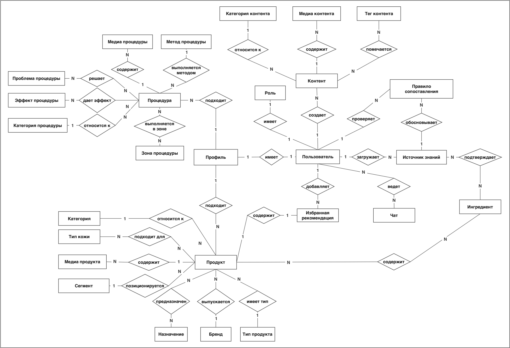
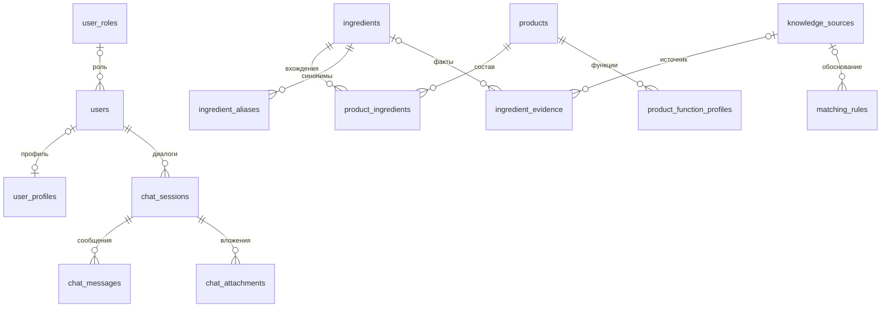
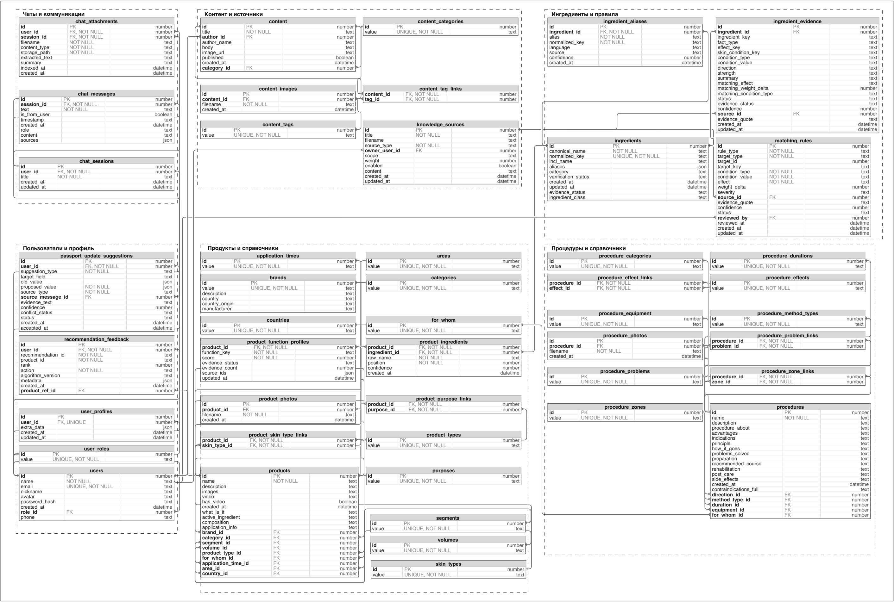
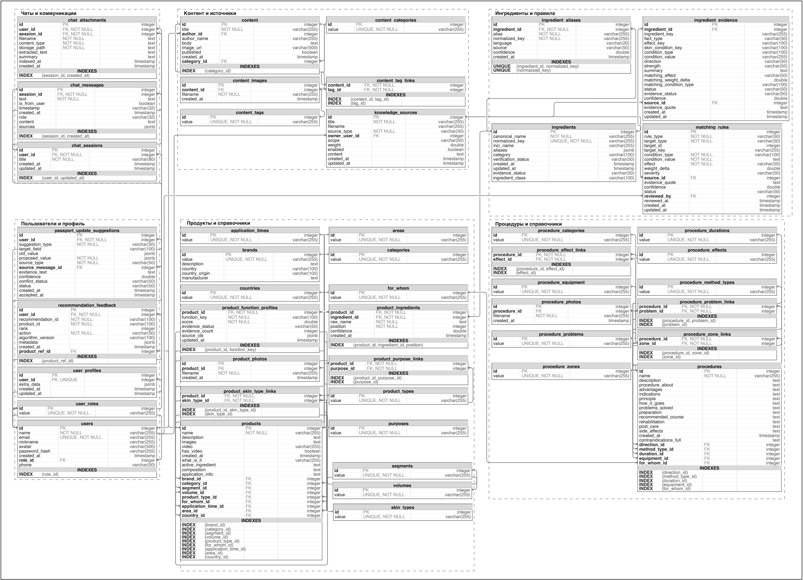
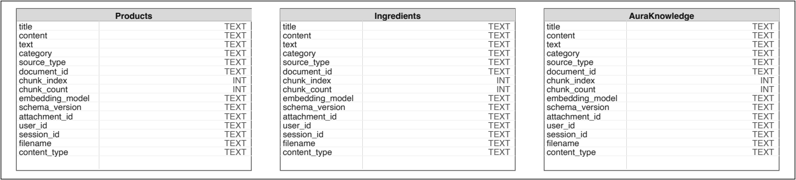

# АИС «Аура»: модель данных

Модель связывает учётную запись и цифровой паспорт кожи с каталогом продуктов, ингредиентами и правилами сопоставления. PostgreSQL хранит структурированные данные и связи, Weaviate обеспечивает поиск по текстовому контексту, файловая система содержит бинарные материалы.

[Процессы и сценарии](processes.md) · [Бизнес-правила](business-rules.md)

## Источники и статус модели

| Источник | Использованные разделы |
| --- | --- |
| [Спецификация требований](../requirements.pdf) | § 2.3, 4.1–4.3; `SR-DB-1.1`–`SR-DB-1.11`, `SR-DB-2.1` |
| [Текст ВКР](https://github.com/KristinaShishigina00/Aura/blob/master/docs/thesis.pdf) | § 2.2; стр. 34–36, 58–59; рисунки 8, А.5–А.7 |
| [Материалы портфолио](https://disk.yandex.ru/d/VklDQSwuq2aAjw) | Концептуальная, логическая и физическая схемы; модель Weaviate |
| [SQL-схема](../../backend/db/schema_sql.py) и [дополнения схемы](../../backend/db/schema_specs.py) | Физические таблицы, ключи, ограничения и индексы |
| [VectorStore](../../ai-service/app/infrastructure/vector_store.py) и [конфигурация AI-сервиса](../../ai-service/app/core/config.py) | Коллекции, свойства объектов, генерация векторов |

Сверка кода выполнена статически на локальной ревизии `f4d01c6`; схема работающей БД не запрашивалась. На уровне требований описаны информационные объекты. В физической реализации часть этих объектов находится внутри JSONB либо вычисляется при запросе. Эти уровни ниже разделены.

## 1. Распределение данных по хранилищам

| Хранилище | Данные | Назначение |
| --- | --- | --- |
| PostgreSQL | Пользователи, профиль, каталоги, ингредиенты, факты, правила, сессии и сообщения | Идентификация объектов, транзакции и целостность связей |
| Weaviate | Текстовые представления продуктов, ингредиентов, знаний и контекста документов | Семантический и гибридный поиск для интеллектуальных функций |
| Файловая система сервера | Изображения, видео и загруженные файлы | Бинарное содержимое; в БД хранятся пути и метаданные |

Векторное хранилище дополняет PostgreSQL. Идентификаторы и метаданные позволяют связать найденный текстовый контекст с исходными материалами и пользовательской сессией; реляционные внешние ключи между PostgreSQL и Weaviate не определены.

## 2. Информационные объекты спецификации

| Требование | Объект | Значимые атрибуты | Представление в коде и схемах |
| --- | --- | --- | --- |
| `SR-DB-1.1` | Учётная запись | Идентификатор, email, имя, защищённый пароль, роль | `users`, `user_roles` |
| `SR-DB-1.2` | Паспорт кожи | Пользователь, характеристики кожи, предпочтения, климат, аллергены, дата | `user_profiles.extra_data`, данные анкеты |
| `SR-DB-1.3` | Продукт | Название, бренд, описание, изображения и видео | `products`, `product_photos`, справочники |
| `SR-DB-1.4` | Ингредиент | Идентификатор и INCI-наименование | `ingredients`, дополнительно `ingredient_aliases` |
| `SR-DB-1.5` | Состав | Продукт, ингредиент, концентрация, позиция | `products.composition`, `product_ingredients`; отдельного поля концентрации нет |
| `SR-DB-1.6` | Рекомендация | Пользователь, продукт, совместимость, дата | Результат вычисления; отдельная таблица рекомендаций в проверенном DDL отсутствует |
| `SR-DB-1.7` | База знаний | Заголовок, текст, категория | `content`, `knowledge_sources`, коллекция `AuraKnowledge` |
| `SR-DB-1.8` | Сессия чата | Пользователь, время начала, контекст | `chat_sessions`, связанные сообщения и вложения |
| `SR-DB-1.9` | Сообщение | Сессия, отправитель, текст, вложения, время | `chat_messages`; файлы отдельно в `chat_attachments` на уровне сессии |
| `SR-DB-1.10` | История процедур | Пользователь, название, тип и дата процедуры | `extra_data.skin_journal.procedures` |
| `SR-DB-1.11` | Измерения | Пользователь, увлажнённость, жирность, время | `extra_data.skin_journal.sensor_readings` |

История процедур и телеметрия имеют приоритет «Крайне желательное». Остальные объекты таблицы 10 спецификации — «Обязательное».

## 3. Концептуальная модель

Ключевые связи предметной области:

- Пользователь имеет персональный профиль и ведёт собственные диалоги.
- Продукт содержит ингредиенты; один ингредиент может входить в разные продукты.
- Сведения о действии ингредиента опираются на источник знаний.
- Правило сопоставления задаёт условие применения и эффект для подбора.
- Каталоги продуктов и процедур связаны с классификаторами и медиа.
- Обучающий контент имеет автора, категорию и теги.

<details>
<summary>Концептуальная ER-диаграмма — рисунок А.5, страница 104 ВКР</summary>



</details>

## 4. Физическая модель PostgreSQL: 47 таблиц

В ВКР указано 47 таблиц. В проверенном `schema_sql.py` найдены объявления тех же 47 уникальных таблиц. Группировка ниже служит навигацией; общие справочники учитываются один раз.

| Домен | Количество | Таблицы |
| --- | --- | --- |
| Пользователи и профиль | 4 | `users`, `user_roles`, `user_profiles`, `passport_update_suggestions` |
| Продукты и справочники | 17 | `products`, `product_photos`, `product_ingredients`, `product_function_profiles`, `product_purpose_links`, `product_skin_type_links`, `brands`, `categories`, `segments`, `volumes`, `product_types`, `for_whom`, `purposes`, `skin_types`, `application_times`, `areas`, `countries` |
| Ингредиенты и правила | 4 | `ingredients`, `ingredient_aliases`, `ingredient_evidence`, `matching_rules` |
| Контент и источники | 6 | `content`, `content_images`, `content_categories`, `content_tags`, `content_tag_links`, `knowledge_sources` |
| Чаты | 3 | `chat_sessions`, `chat_messages`, `chat_attachments` |
| Процедуры и справочники | 12 | `procedures`, `procedure_photos`, `procedure_categories`, `procedure_method_types`, `procedure_durations`, `procedure_equipment`, `procedure_zones`, `procedure_effects`, `procedure_problems`, `procedure_zone_links`, `procedure_effect_links`, `procedure_problem_links` |
| Обратная связь | 1 | `recommendation_feedback` |

### Основные таблицы и единица хранения

| Таблица | Одна запись означает | Ключи и значимые поля |
| --- | --- | --- |
| `users` | Учётную запись | PK `id`; уникальный `email`; `password_hash`; FK `role_id` |
| `user_roles` | Роль | PK `id`; уникальное `value` |
| `user_profiles` | Профиль пользователя | PK `id`; уникальный FK `user_id`; `extra_data JSONB` |
| `passport_update_suggestions` | Предложение изменить профиль | PK `id`; FK `user_id`, `source_message_id`; `proposed_value`, `status`, `confidence` |
| `products` | Косметический продукт | PK `id`; название, описание, состав, медиа; FK на классификаторы |
| `product_ingredients` | Вхождение ингредиента в состав на конкретной позиции | Составной PK `(product_id, ingredient_id, position)`; два FK; `raw_name`, `confidence` |
| `product_function_profiles` | Оценку одной функции продукта | Составной PK `(product_id, function_key)`; `score`, `evidence_status`, `evidence_count`, `source_ids` |
| `ingredients` | Канонический ингредиент | PK `id`; уникальный `normalized_key`; `canonical_name`, `inci_name`, статусы |
| `ingredient_aliases` | Альтернативное имя ингредиента | PK `id`; FK `ingredient_id`; `alias`, `normalized_key`, `language`, `confidence` |
| `ingredient_evidence` | Факт о действии ингредиента | PK `id`; FK `ingredient_id`, `source_id`; условие, эффект, цитата, уверенность и статус |
| `matching_rules` | Правило сопоставления | PK `id`; цель, условие, `effect`, `weight_delta`, статус; FK источника и проверившего сотрудника |
| `knowledge_sources` | Источник знаний | PK `id`; заголовок, текст, тип, файл, область применения, вес и активность; FK владельца |
| `content` | Обучающий материал | PK `id`; FK автора и категории; заголовок, текст, `published` |
| `chat_sessions` | Сессию диалога | PK `id`; FK `user_id`; название и даты |
| `chat_messages` | Сообщение в сессии | PK `id`; FK `session_id`; текст, отправитель, время, источники |
| `chat_attachments` | Файл, добавленный пользователем в сессию | PK `id`; FK пользователя и сессии; путь, MIME-тип, извлечённый текст и время индексации |
| `procedures` | Процедуру в общем каталоге | PK `id`; название, описание и характеристики; FK на справочники |
| `recommendation_feedback` | Действие пользователя над рекомендацией | PK `id`; FK `user_id`, дополнительный `product_ref_id`; строковые идентификаторы рекомендации и продукта, действие, версия алгоритма |

`matching_rules.target_id` и `target_key` задают цель правила, но `target_id` не объявлен в проверенном DDL как FK на конкретный продукт или ингредиент. `source_ids` функционального профиля — JSONB, а не таблица связей с внешними ключами.

### Ключевые связи

Следующая диаграмма упрощает физическую модель до основного контура. Для `user_profiles.user_id` сохранена допускаемая DDL необязательность: поле имеет `UNIQUE` и FK, но не `NOT NULL`.



### Связи многие-ко-многим

| Связь | Промежуточная таблица | Дополнительный смысл |
| --- | --- | --- |
| Продукт ↔ ингредиент | `product_ingredients` | Позиция и исходное написание компонента |
| Продукт ↔ назначение | `product_purpose_links` | Несколько задач одного продукта |
| Продукт ↔ тип кожи | `product_skin_type_links` | Применимость к нескольким типам |
| Контент ↔ тег | `content_tag_links` | Тематическая классификация |
| Процедура ↔ зона | `procedure_zone_links` | Области проведения |
| Процедура ↔ эффект | `procedure_effect_links` | Ожидаемые эффекты в каталоге |
| Процедура ↔ проблема | `procedure_problem_links` | Проблемы, указанные для процедуры |

<details>
<summary>Полная логическая и физическая ERD — рисунки А.6 и А.7</summary>





</details>

## 5. JSONB-профиль и личный журнал

Паспорт кожи и журнал хранятся в `user_profiles.extra_data`. Подтверждённые по коду пути:

```text
user_profiles.extra_data
├── skin_passport
│   ├── completed_at_epoch_millis
│   └── answers
└── skin_journal
    ├── settings
    ├── procedures
    ├── sensor_readings
    └── reminders
```

`answers` содержит ответы анкеты; `procedures` — личные записи о выполненных процедурах; `sensor_readings` — измерения; `reminders` — напоминания. Это вложенные объекты, а не самостоятельные таблицы PostgreSQL.

Разделение фиксированных справочников и изменяемого профиля позволяет дополнять анкету без отдельного столбца на каждый ответ. Проверка структуры JSONB выполняется на уровне прикладных моделей и функций. Ключи внутри JSONB не получают автоматически ограничения FK или `NOT NULL` реляционной схемы.

Источники: [паспорт кожи](../../backend/core/passport_context.py), [журнал](../../backend/core/skin_journal.py), [предложения обновления](../../backend/core/passport_updates.py).

## 6. Векторная модель Weaviate

В рисунке 8 ВКР выделены три коллекции: Products, Ingredients и AuraKnowledge. В текущей конфигурации имена двух первых записаны строчными буквами: `products`, `ingredients`; третья — `AuraKnowledge`. Также предусмотрен префикс `knowledge_user_` для пользовательского контура знаний.

| Коллекция | Назначение |
| --- | --- |
| `products` | Поиск по текстовым представлениям продуктов |
| `ingredients` | Поиск по информации об ингредиентах |
| `AuraKnowledge` | Поиск по базе знаний и релевантному контексту |

В коде `VectorStore.create_collection` определены текстовые свойства:

| Группа | Свойства |
| --- | --- |
| Основное содержимое | `title`, `name`, `content`, `text`, `description`, `category` |
| Источник | `source_type`, `filename`, `content_type` |
| Контекст пользователя и сессии | `attachment_id`, `user_id`, `session_id` |

Векторы передаются отдельно от текстовых свойств. Конфигурация задаёт модель `sentence-transformers/all-MiniLM-L6-v2` и размерность `384`; автоматический векторизатор коллекции выключен, эмбеддинги создаёт сервис приложения.

В схеме ВКР дополнительно показаны `document_id`, `chunk_index`, `chunk_count`, `embedding_model`, `schema_version`. В проверенном объявлении свойств `VectorStore` эти поля не определены. Их наличие в уже созданном рабочем хранилище не проверялось.

<details>
<summary>Логическая структура Weaviate — рисунок 8, страница 35 ВКР</summary>



</details>

## 7. Целостность и жизненный цикл

| Механизм | Применение |
| --- | --- |
| Первичные ключи | Идентификация записей; составные ключи для связей и функциональных профилей |
| Уникальные ограничения | Email пользователя, профиль по `user_id`, нормализованные ингредиенты и значения справочников |
| Внешние ключи | Связи с пользователем, продуктом, ингредиентом, сессией, источником и классификаторами |
| `ON DELETE CASCADE` | Удаление связанных профилей, пользовательских сессий и сообщений, состава и дочерних медиа-записей |
| `ON DELETE SET NULL` | Сохранение фактов и правил при удалении источника; обнуление ссылок на удалённое сообщение или сотрудника там, где это задано |
| Транзакции | Требование атомарного сохранения связанных данных (`SR-QA-2.3`); журнал использует блокировку строки профиля |
| Индексы | Выборка сессий по пользователю и времени, сообщений и вложений по сессии, поддержка FK и каталогов |

`SR-DB-2.1` требует удалять при удалении аккаунта профиль, историю процедур и диалогов. SQL-каскады относятся к записям PostgreSQL. Удаление физических файлов и пользовательских векторов должно проверяться отдельно; оно не следует из FK.

Внесённые в профиль предложения хранят старое и предлагаемое значение, источник, статус и сведения о конфликте. Применение обновления выполняется после принятия предложения; повторная обработка уже принятого или отклонённого предложения блокируется текущим кодом.

## 8. Различия между требованиями и физическим представлением

| Пункт | Требования / проектная модель | Проверенный код / схема | Значение для документации |
| --- | --- | --- | --- |
| Концентрация ингредиента | `SR-DB-1.5` включает концентрацию | В `product_ingredients` есть позиция, но нет отдельного поля концентрации | Позиционный вес — аппроксимация, а не сохранённая массовая доля |
| Хранение рекомендаций | `SR-DB-1.6` описывает рекомендацию как объект | В DDL нет самостоятельной таблицы; есть `recommendation_feedback` | Обратная связь не заменяет запись результата рекомендации |
| Процедуры и измерения | `SR-DB-1.10`, `SR-DB-1.11` перечисляют объекты истории | Хранение в `skin_journal` внутри JSONB | Не добавлять на ERD вымышленные таблицы телеметрии |
| Вложения сообщения | `SR-DB-1.9` указывает вложения | `chat_attachments` ссылается на сессию и пользователя; `message_id` отсутствует | Связь файлов непосредственно с конкретным сообщением не закреплена этим DDL |
| Метаданные векторов | Рисунок 8 содержит сведения о фрагментах и версии схемы | Часть показанных полей отсутствует в `create_collection` | Отличать проектную схему от объявления коллекций в коде |

Различия не означают, что схема работающей установки совпадает с проверенным исходным файлом: её фактическое состояние необходимо сверять с БД отдельно. Полные исходные изображения доступны в папке [images/](images/); происхождение и страницы записаны в [sources.json](images/sources.json).
