# АИС «Аура»: бизнес-процессы и пользовательские сценарии

«Аура» автоматизирует персонализированный подбор косметических продуктов на основе цифрового паспорта кожи, состава средств и базы знаний. Документ описывает переход от самостоятельного выбора косметики к подбору с использованием системы, основные сценарии пользователя и служебные процессы.

[Модель данных](data-model.md) · [Бизнес-правила](business-rules.md)

## Источники и границы описания

- **ВКР:** «Информационная система персонализированного подбора косметических продуктов в дерматологии с интеграцией чата на основе технологии RAG», § 1.4, 2.1–2.2, 2.4, приложение А. [Полный текст](https://github.com/KristinaShishigina00/Aura/blob/master/docs/thesis.pdf).
- **Спецификация требований:** разделы 1.3, 2.2, 3–6. [requirements.pdf](../requirements.pdf).
- **Исходные материалы портфолио:** [Яндекс Диск](https://disk.yandex.ru/d/VklDQSwuq2aAjw).
- Для уточнения хранения и отдельных ветвей выполнена статическая сверка локального кода на ревизии `f4d01c6`. Выполнение сценариев в работающем приложении в рамках подготовки документа не проверялось.

Номера страниц ниже относятся к страницам PDF ВКР. Изображения экспортированы из того же текста ВКР; полный размер открывается по нажатию на изображение. Идентификаторы `PROC-01`–`PROC-09` введены для навигации в этом документе. Идентификаторы `UR-*` и `SR-*` сохранены из спецификации.

В границы MVP входят анкета, ручной ввод показателей внешнего датчика, расчёт совместимости, каталог, RAG-чат и служебные функции. Покупка и доставка, публикация отзывов, постановка диагнозов и интеграция с медицинскими информационными системами исключены из реализации (§ 1.3 спецификации).

## 1. Участники процесса

| Участник | Задачи в системе | Основание |
| --- | --- | --- |
| Пользователь | Заполнить паспорт кожи, получить рекомендации, вести диалог и журнал ухода | `UR-01`–`UR-03` |
| Дерматолог-косметолог | Создавать обучающий контент, проверять извлечённые знания и правила | `UR-04`, `SR-F-5.3` |
| Контент-менеджер | Вести продукты и справочники, модерировать существующий обучающий контент | `UR-05`, `UR-06` |
| Администратор | Управлять системой, данными и распределением ролей | `UR-07`, `SR-F-5.1` |
| Внешний датчик | Дать пользователю числовые показатели для ручного ввода; прямое подключение к приложению не требуется | `SR-F-2.1` |
| Внешние сервисы | Предоставить погодные данные и генерацию ответа LLM | ВКР, § 2.1; `SR-IF-2.2` |

Гостевой доступ в спецификации отсутствует. Пользовательские сценарии выполняются после регистрации или входа.

## 2. Текущее состояние: самостоятельный подбор косметики (AS-IS)

**Цель процесса:** самостоятельно выбрать средство или линейку ухода при возникновении потребности. ВКР рассматривает проблемный путь, при котором выбор затрудняют противоречивая информация и маркетинговое воздействие.

| Этап IDEF0 | Действие | Результат этапа |
| --- | --- | --- |
| A1 | Сформировать потребность | Запрос на решение проблемы кожи |
| A2 | Провести информационный поиск | Набор потенциальных продуктов и сведения из открытых источников |
| A3 | Принять решение о покупке | Выбор конкретного средства |
| A4 | Приобрести и использовать средство | Применённый продукт и затраченные средства |
| A5 | Получить результат и оценить его | Оценка результата; при неудовлетворительном исходе — повторный поиск |

**Входы:** дискомфорт кожи, внешние социальные стимулы, финансовые ресурсы. **Управляющие факторы проблемной модели:** реклама, недостаток компетенций и объективных данных, опора на цену и оформление. **Механизмы:** пользователь, поисковые системы, социальные сети, маркетплейсы и ритейл.

В схеме показаны риски негативного результата, финансовых потерь и повторного возникновения потребности. Это характеристика анализируемой модели, а не утверждение о неизбежном исходе любой самостоятельной покупки.

Схемы AS-IS: контекст и декомпозиция

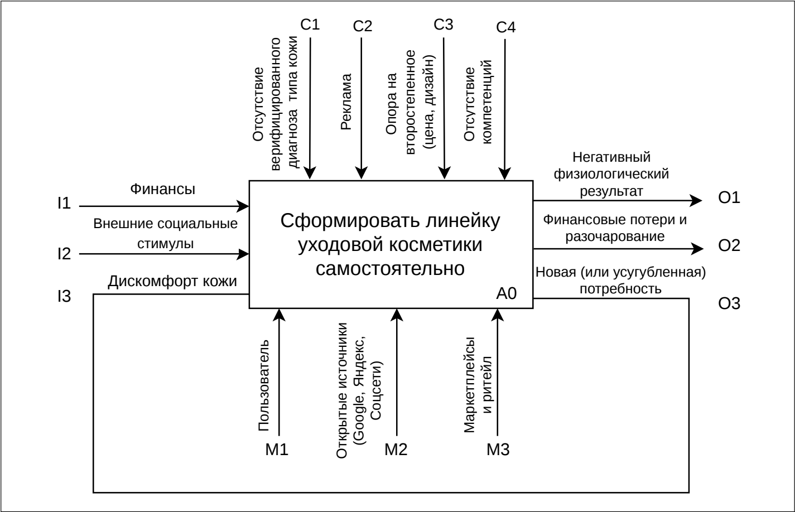

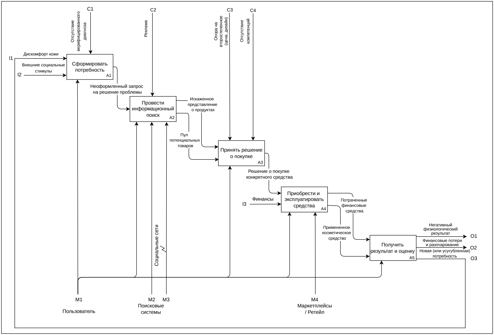

## 3. Целевое состояние: подбор с помощью «Ауры» (TO-BE)

**Цель процесса:** связать потребности пользователя с составом косметических продуктов и получить объяснимый персонализированный подбор.

| Этап IDEF0 | Действие | Вход и результат |
| --- | --- | --- |
| A1 | Собрать анамнез | Ответы пользователя → структурированные данные анкеты |
| A2 | Получить аппаратные показатели | Измерения внешним датчиком → показатели для ручного ввода |
| A3 | Сформировать цифровой профиль кожи | Анкета и доступные измерения → профиль и вектор потребностей |
| A4 | Сформировать рекомендации и показать совместимость | Профиль, продукты, ингредиенты и правила → ранжированный список с объяснениями |
| A5 | Приобрести выбранное средство | Выбор пользователя → покупка у внешнего продавца |

**Управление:** клиническая база знаний, каталог ингредиентов и продуктов, математическая модель и правила оценки. **Механизмы:** пользователь, мобильное приложение, внешний датчик, внешний ритейл.

Этап A5 включён в сквозной бизнес-процесс, но находится за границами автоматизации «Ауры». Указанное на исходной схеме улучшение состояния кожи является целевым эффектом; сама схема не доказывает его достижение.

Схемы TO-BE: контекст и декомпозиция

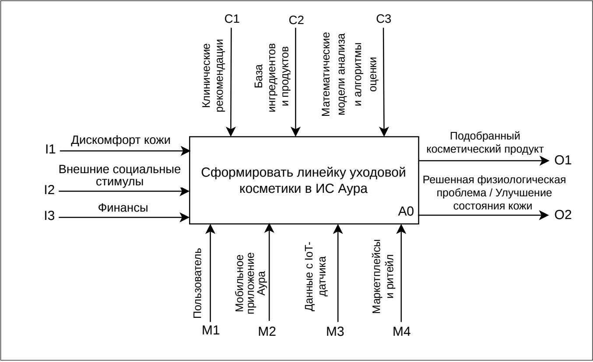

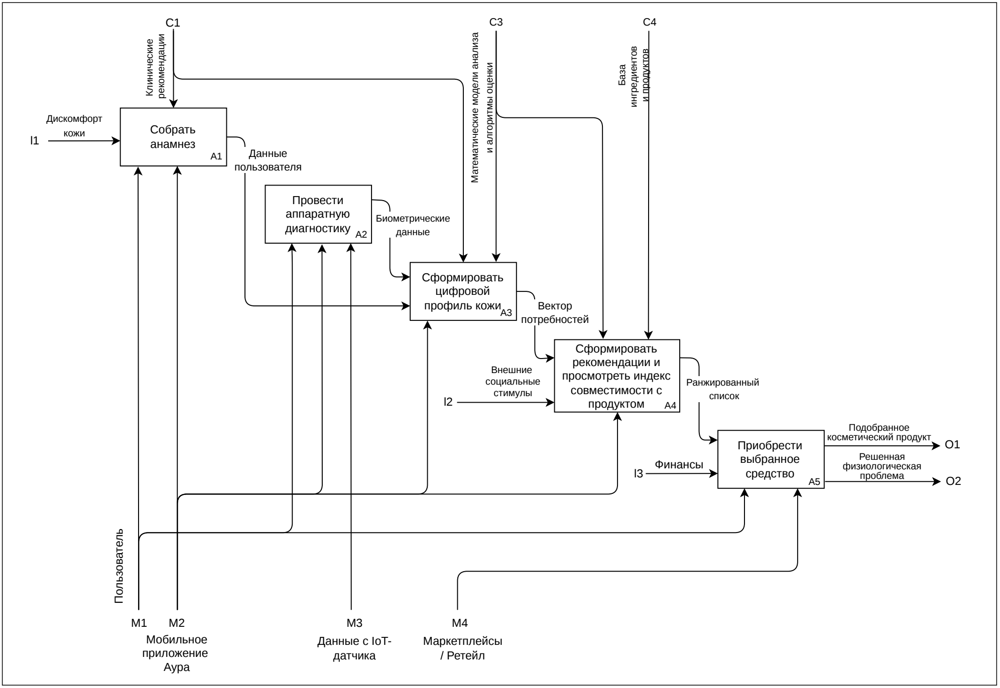

## 4. Основные пользовательские сценарии

### PROC-01. Регистрация, вход и формирование паспорта кожи

**Участник:** пользователь. **Триггер:** первое использование системы или необходимость обновить профиль. **Основание:** `SR-F-1.1`–`SR-F-1.3`, `SR-IF-1.2`, `SR-QA-1.2`.

1. Пользователь регистрируется или входит по email и паролю.
2. При успешной авторизации система выдаёт токен доступа.
3. Пользователь заполняет анкету и указывает индивидуальные ограничения, включая аллергены и непереносимости.
4. Интерфейс проверяет формат и заполнение обязательных полей.
5. Система сохраняет профиль для дальнейшего расчёта совместимости и формирования контекста чата.

**Результат:** пользователь авторизован, данные цифрового паспорта сохранены. **Альтернативные ветви:** при некорректной форме отправка блокируется; при недействительном или просроченном токене защищённый запрос отклоняется, клиент возвращается к авторизации (`SR-IF-3.2`).

### PROC-02. Ручной ввод показателей кожи

**Участник:** пользователь. **Предусловие:** пользователь получил показатели с внешнего анализатора. **Основание:** `SR-F-2.1`, `SR-F-5.4`, рисунок А.3.

1. Пользователь выполняет измерение внешним прибором.
2. Открывает форму ввода показателей в приложении.
3. Вносит числовые значения и дату измерения.
4. Система сохраняет запись и использует доступные показатели при построении профиля и расчёте рекомендаций.

**Результат:** журнал содержит новый замер. По схеме А.3 при отсутствии датчика аппаратная ветвь пропускается, процесс продолжается с анкетными данными. Ввод реализован вручную; автоматическая синхронизация с прибором в спецификации не заявлена.

### PROC-03. Получение персонализированного подбора

**Участник:** пользователь. **Предусловия:** авторизация, данные профиля, доступный каталог. **Основание:** `UR-02`, `SR-F-3.1`–`SR-F-3.3`; ВКР, § 2.4.

1. Система получает параметры пользователя и составы продуктов.
2. Проверяет наличие данных для расчёта и применяет ограничения безопасности.
3. Для допустимых продуктов вычисляет совместимость и причины оценки.
4. Ранжирует кандидатов и формирует результат подбора.
5. Пользователь просматривает список, индекс и карточку выбранного продукта.
6. При необходимости переходит в чат с контекстом продукта.

**Исключения:** ингредиент из стоп-листа пользователя → совместимость `0%` и предупреждение; недостаточные сведения о составе → статус «Недостаточно данных», без прерывания работы приложения. Детали формулы, порогов и различий между проектной моделью и текущим кодом приведены в [бизнес-правилах](business-rules.md).

Алгоритм подбора и последовательность вычислений

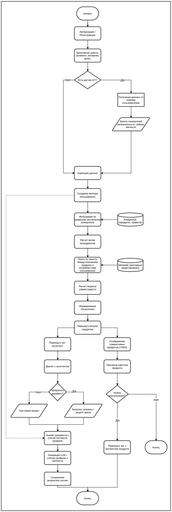

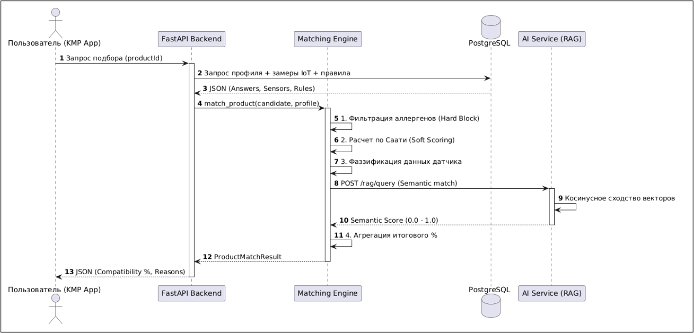

### PROC-04. Консультация с RAG-ассистентом

**Участник:** пользователь. **Триггер:** вопрос в чате либо переход из карточки продукта. **Основание:** `SR-F-4.1`–`SR-F-4.4`; ВКР, стр. 29, 40, 53–55.

1. Пользователь вводит вопрос; при необходимости прикрепляет документ.
2. Сервер добавляет данные профиля и доступный контекст выбранного продукта.
3. AI-сервис выполняет поиск релевантных фрагментов в Weaviate.
4. Результаты поиска переранжируются, отобранный контекст передаётся в LLM вместе с вопросом.
5. Система возвращает ответ с опорой на извлечённые материалы.
6. История сохраняется в рамках пользовательской сессии чата.

**Альтернативная ветвь:** при таймауте или недоступности LLM пользователь получает уведомление; каталог, профиль и расчёт совместимости должны оставаться доступными (`SR-DEP-1.2`, `SR-IF-2.2`, `SR-QA-2.2`). Контекст вложений в ВКР ограничен пользователем и сессией; схема хранения описана в [модели данных](data-model.md).

Последовательность взаимодействия с RAG-ассистентом

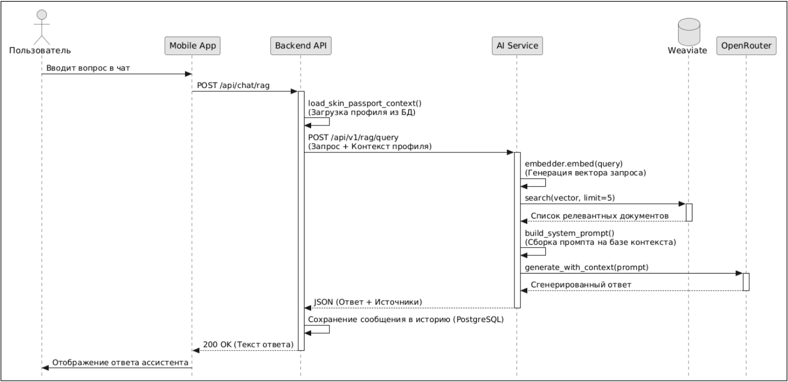

### PROC-05. Ведение журнала процедур и измерений

**Участник:** пользователь. **Основание:** `UR-03`, `SR-F-5.4`, `SR-DB-1.10`, `SR-DB-1.11`; ВКР, стр. 39, 58–59.

1. Пользователь добавляет выполненную процедуру или показания датчика с датой.
2. Система сохраняет запись в личной истории.
3. Пользователь просматривает хронологию изменений.
4. В текущем коде для процедур также предусмотрены напоминания о повторении и последующем уходе; действия над напоминанием — выполнение, перенос и пропуск.

**Результат:** обновлён личный журнал. Раздел журнала имеет приоритет «Крайне желательное» в спецификации. В текущем коде записи находятся в `user_profiles.extra_data.skin_journal`; это уточнение реализации, а не отдельная SQL-таблица истории.

### PROC-06. Получение погодных рекомендаций

**Участники:** пользователь, сервер, Open-Meteo. **Основание:** `UR-02`; ВКР, стр. 30–31.

1. Мобильное приложение запрашивает погодные рекомендации для текущей локации.
2. Сервер получает профиль из PostgreSQL и погодные показатели из внешнего API.
3. Система сопоставляет температуру, влажность и УФ-индекс с особенностями профиля.
4. Возвращает рекомендации по адаптации ухода.

Числовые погодные пороги в приведённом разделе ВКР не определены, поэтому здесь они не добавлены. Обработка отсутствия геолокации или погодного ответа требует отдельной детализации требований.

Интеграция с погодным сервисом

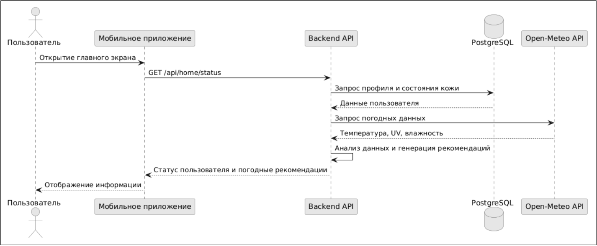

## 5. Служебные процессы

### PROC-07. Ведение каталогов и обучающего контента

Сотрудник входит в административную веб-панель и выполняет доступные его роли действия. Контент-менеджер ведёт продукты и справочники, модерирует существующие обучающие материалы; дерматолог-косметолог создаёт обучающий контент и проверяет знания; администратор управляет системой. Для продуктов, процедур и статей спецификация предусматривает создание, редактирование и скрытие с учётом роли (`UR-04`–`UR-07`, `SR-F-5.1`–`SR-F-5.3`).

Права создания статьи и общие административные полномочия описаны в источниках не полностью согласованно. Матрица и замечания приведены в [бизнес-правилах](business-rules.md).

Варианты использования административной панели и мобильного приложения

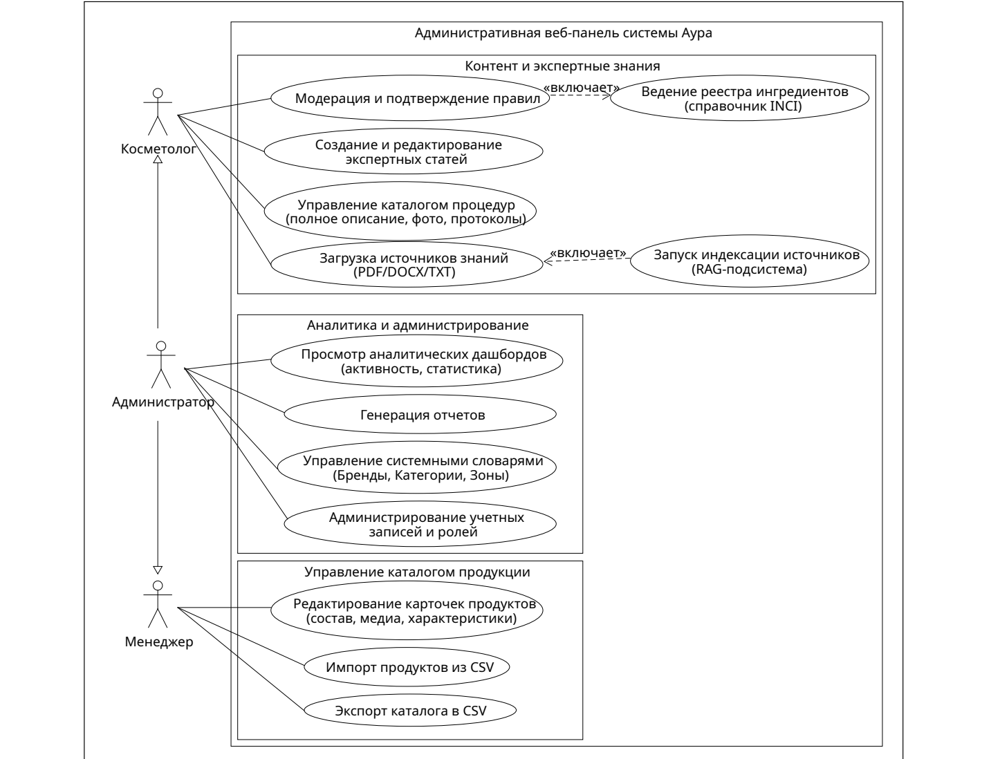

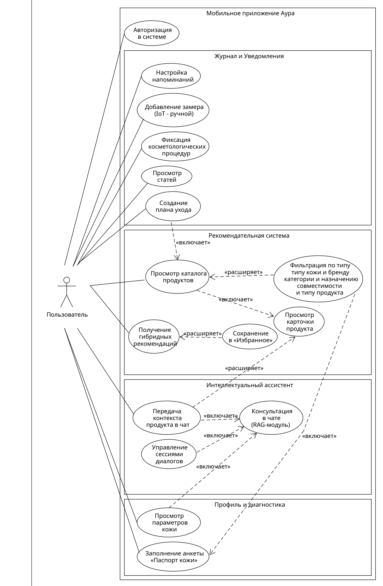

### PROC-08. Загрузка знаний, индексация и модерация фактов

**Участники:** сотрудник с соответствующими правами, система, эксперт. **Основание:** `UR-04`, `SR-F-5.3`; ВКР, стр. 53–55, 60–62.

1. Сотрудник загружает источник знаний и задаёт область применения.
2. Система извлекает текст, нормализует его и делит на фрагменты с перекрытием.
3. Фрагменты преобразуются в векторы и индексируются в Weaviate.
4. Из источника извлекаются сведения об ингредиентах с оценкой уверенности и ссылкой на источник.
5. Факты получают статус; эксперт может подтвердить, отправить на доработку или отклонить их.
6. Допустимые факты используются при формировании функциональных профилей продуктов; подтверждённые правила сопоставления применяются при оценке состава.

Порог автоматической уверенности и различие между **фактом** и **правилом** раскрыты в [бизнес-правилах](business-rules.md). В тексте ВКР и рисунке 20 есть расхождения относительно обязательности ручного подтверждения; они сохранены как замечания к источнику.

Индексация и жизненный цикл фактов

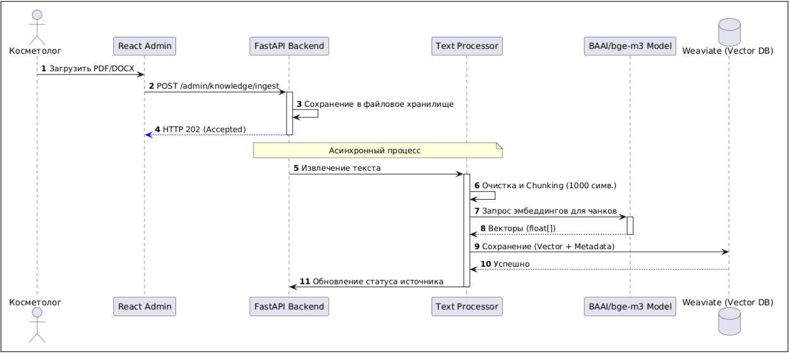

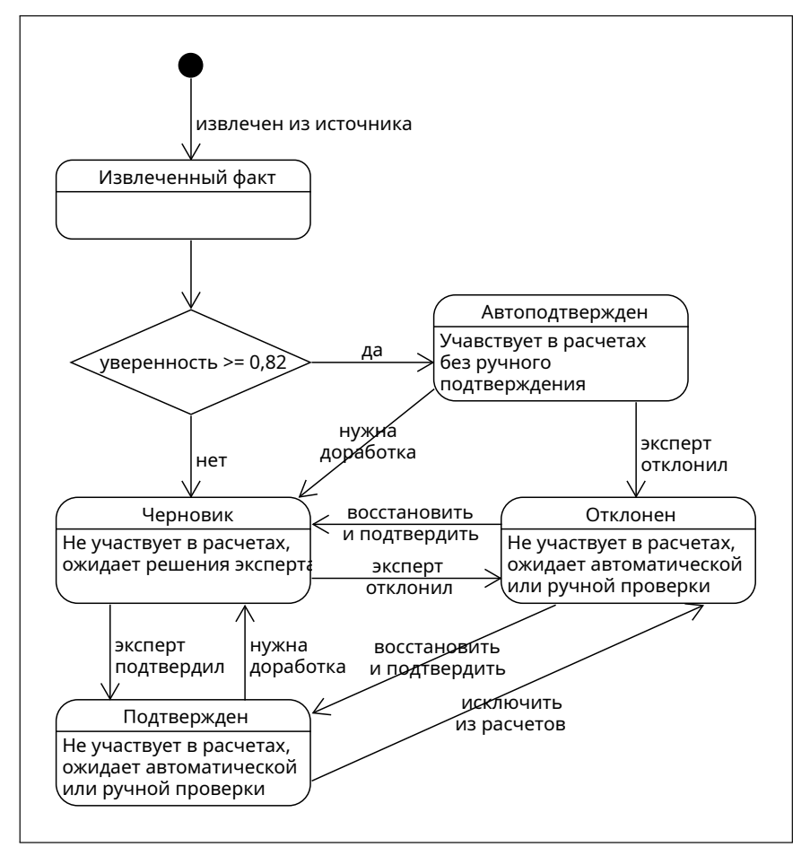

### PROC-09. Удаление учётной записи

**Участник:** пользователь. **Основание:** `SR-DB-2.1`.

При удалении аккаунта система должна удалять связанный профиль, историю процедур и диалогов. В текущем коде удаление аккаунта требует проверки текущего пароля; реляционные связи профиля, сессий, сообщений и вложений используют каскадное удаление. Удаление записей файловой системы и векторных объектов не следует считать доказанным только наличием SQL-каскада: это отдельная часть жизненного цикла данных.

## 6. Условия завершения и исключения

| Ситуация | Ожидаемая реакция | Источник |
| --- | --- | --- |
| Некорректная форма | Блокировка отправки и указание ошибки | `SR-IF-1.2`, `SR-QA-1.2` |
| Недействительный токен | Отклонение запроса и возврат к входу | `SR-IF-3.2` |
| Аллерген в составе | Индекс `0%` и предупреждение | `SR-F-3.2` |
| Недостаточный состав | Статус «Недостаточно данных» | `SR-F-3.3` |
| Недоступная LLM | Уведомление в чате, сохранение остальных функций | `SR-F-4.4`, `SR-QA-2.2` |
| Потеря сети | Блокировка сетевых функций без аварийного завершения | `SR-QA-2.1` |
| Сбой сохранения связанных данных | Откат транзакции | `SR-QA-2.3` |

## 7. Прослеживаемость

| Сценарий | Основные требования | Данные |
| --- | --- | --- |
| PROC-01 | `SR-F-1.1`–`SR-F-1.3` | Учётная запись, профиль |
| PROC-02 | `SR-F-2.1`, `SR-F-5.4` | Измерения, журнал |
| PROC-03 | `SR-F-3.1`–`SR-F-3.3` | Продукты, ингредиенты, правила, профиль |
| PROC-04 | `SR-F-4.1`–`SR-F-4.4` | Сессии, сообщения, вложения, знания |
| PROC-05 | `SR-F-5.4` | Процедуры и хронология пользователя |
| PROC-06 | `UR-02` | Профиль и внешние погодные показатели |
| PROC-07 | `UR-04`–`UR-07`, `SR-F-5.1`–`SR-F-5.3` | Каталоги, контент, роли |
| PROC-08 | `UR-04`, `SR-F-5.3` | Источники, факты, правила, векторы |
| PROC-09 | `SR-DB-2.1` | Профиль и связанные пользовательские записи |

Для сверки реализации использованы [журнал кожи](../../backend/core/skin_journal.py), [удаление аккаунта](../../backend/core/profile_account_service.py), [скоринг](../../backend/core/matching/scoring.py), [модерация](../../backend/core/matching/admin.py) и [SQL-схема](../../backend/db/schema_sql.py). Эти ссылки рассчитаны на размещение документа в `docs/analysis/` репозитория Aura.
